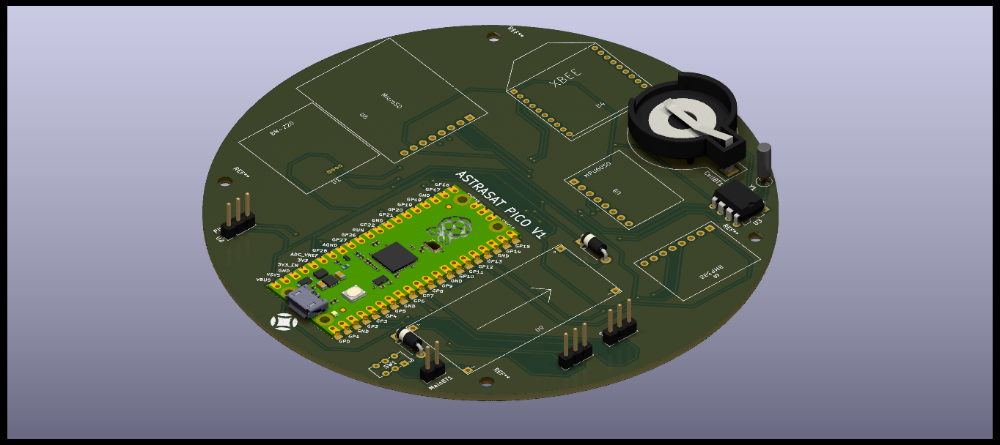
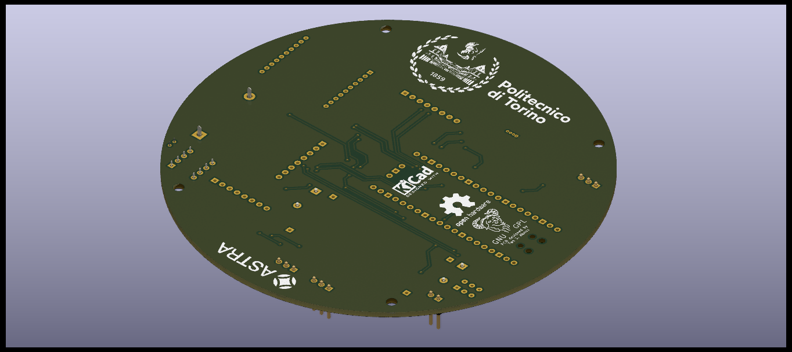

# cansat-circuits
Diagrams, circuits, schemas and gerber files of Astra's Cansat

## Components
Check out our [Notion page](https://www.notion.so/astrateampolito/Components-Sensor-Payload-24f630e80aeb4f689f4a4227b104ff25) for components.

## Pictures
### PCB

## TO-DO
- [X] Creation of part list
- [X] Ordering of parts
- [] Connecting and testing parts
- [x] Creation of schematics
- [x] Creation of PCB
- [x] Creation of gerber files for manufacturing
- [] Ordering and testing
