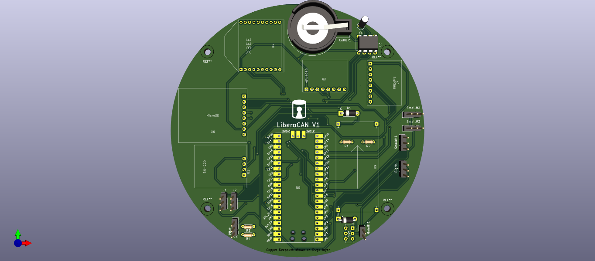
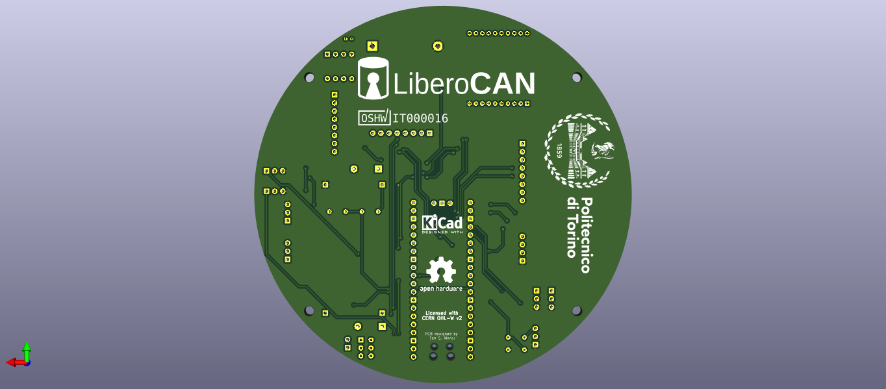

# cansat-circuits
Diagrams, circuits, schemas and gerber files of LiberoCAN free and open source CanSat

## Components
Check out our [docs](https://github.com/liberocan/cansat-docs/blob/main/CIRCUIT.md) for components.

## Pictures
### PCB

## TO-DO
- [X] Creation of part list
- [X] Ordering of parts
- [] Connecting and testing parts
- [x] Creation of schematics
- [x] Creation of PCB
- [x] Creation of gerber files for manufacturing
- [] Ordering and testing

## License
This free and open source hardware project is licensed with [CERN Open Hardware License Version 2 - Weakly Reciprocal](https://ohwr.org/project/cernohl/-/wikis/uploads/82b567f43ce515395f7ddbfbad7a8806/cern_ohl_w_v2.txt)
